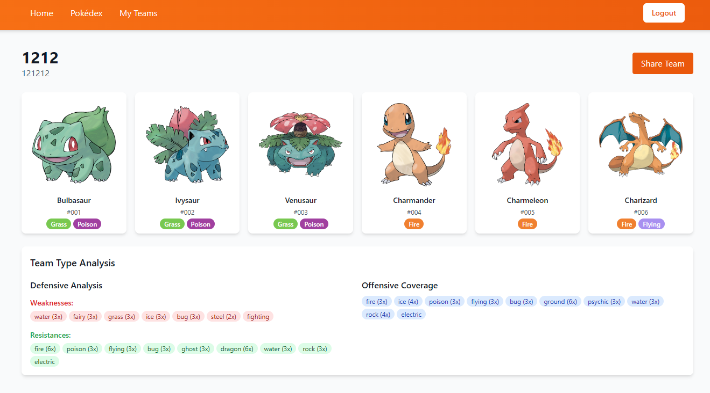

# Pokemon Team Builder

A full-stack React application that allows users to create, manage, and share Pokemon teams with enterprise-level considerations for performance, security, and scalability.



## Documentation

Detailed documentation is available in the docs folder:

- [Architecture Overview](./docs/architecture.md) - System design and component architecture
- [Enterprise Considerations](./docs/enterprise_considerations.md) - Performance, security, and scalability details
- [Supabase Setup](./docs/supabase.md) - Database configuration and security policies
- [Testing Strategy](./docs/testing.md) - Test organization and methodology
- [Deployment Guide](./docs/deployment.md) - CI/CD workflow and deployment process

## Features

- **Pokemon Browsing**: Search and filter Pokemon by name, type, and generation
- **Team Management**: Create custom teams with up to 6 Pokemon
- **Team Analysis**: View type coverage, weaknesses, and resistances for your team
- **Sharing**: Generate shareable links for your Pokemon teams
- **User Authentication**: Secure account creation and management

## Tech Stack

- **Frontend**: React 18, TypeScript, Tailwind CSS
- **State Management**: React Query, Context API
- **Authentication**: Supabase Auth
- **Database**: Supabase PostgreSQL
- **Deployment**: GitHub Actions, GitHub Pages
- **Testing**: Jest, React Testing Library

## Enterprise Considerations

### Performance
- Optimized API calls with caching via React Query
- Pagination for large data sets
- Debounced search for reduced API load

### Security
- JWT token-based authentication
- Protected routes for authenticated content
- Input validation for user-submitted data
- Environment variable protection for sensitive keys

### Scalability
- Modular component architecture
- Separation of concerns (hooks, services, components)
- Optimized database queries

## Installation and Setup

### Prerequisites
- Node.js 16+ and npm
- A Supabase account for backend services

### Local Development
1. Clone the repository:
    ```bash
    git clone https://github.com/yourusername/pokemon-team-assignment.git
    cd pokemon-team-assignment
    ```
2. Install dependencies:
    ```bash
    npm install
    ```
3. Create a .env file in the root directory with your Supabase credentials:
    ```
    REACT_APP_SUPABASE_URL=your_supabase_url
    REACT_APP_SUPABASE_ANON_KEY=your_supabase_anon_key
    ```
4. Start the development server:
    ```bash
    npm start
    ```
5. Run tests:
    ```bash
    npm test
    ```
## Deployment
This application is configured for automatic deployment to GitHub Pages using GitHub Actions:

1. Push changes to the main branch
2. GitHub Actions will automatically run tests and build the application
3. If tests pass, the application is deployed to GitHub Pages

Manual deployment can be performed with:
```bash
npm run deploy
```

## Project Structure
```markdown
src/
├── components/     # UI components organized by feature
├── contexts/       # React contexts for state management
├── hooks/          # Custom React hooks
├── lib/            # Library configurations
├── pages/          # Page components
├── services/       # API and data services
├── styles/         # Global styles and CSS
├── types/          # TypeScript type definitions
└── utils/          # Utility functions and helpers
```